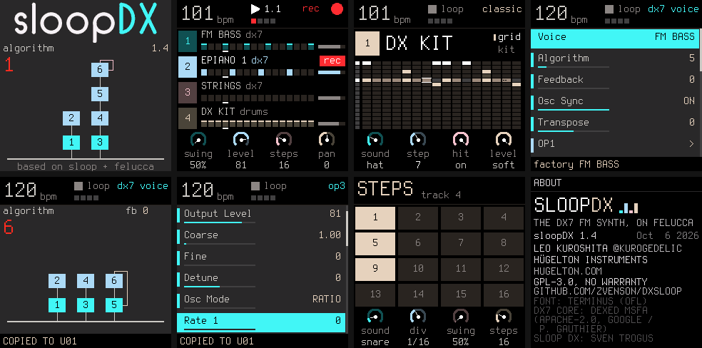
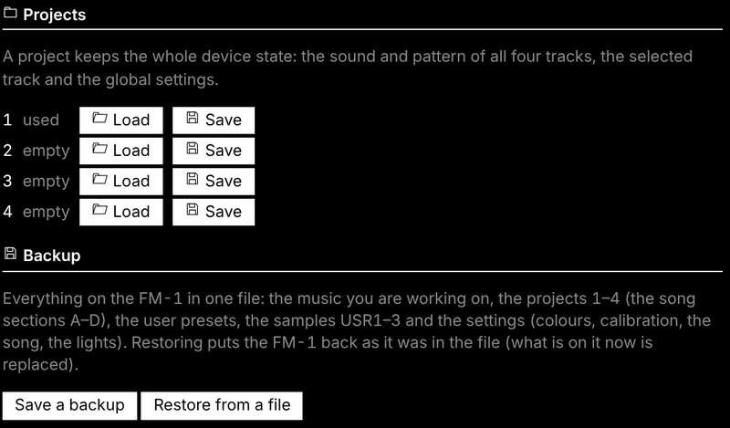

<b>Custom firmware for the M-VAVE FM-1: FM drums you program on the device, and a DX7 on top (six operators, 32 algorithms, real voice editing).</b> 
Free and open source (GPL-3.0). A fork of <a href="https://github.com/isod89/sloop-fm1">SLOOP</a>, which is based on <a href="https://github.com/hugelton/Felucca">Felucca</a>. Not affiliated with either.

<a href="https://dx7.designburgapps.com/"><b>Install from the browser</b></a> ·
<a href="SLOOP.md">Manual</a> ·
<a href="https://dx7.designburgapps.com/sloopdx-cheat-sheet.pdf">Cheat Sheet (2 × A4)</a> ·
<a href="https://dx7.designburgapps.com/webapp/editor/">Web editor</a> ·
<a href="../../releases">Releases</a> ·
<a href="../../issues">Report a bug</a>

 
<a href="https://www.youtube.com/watch?v=qas9XWBgpL4">sloopDX 2.5 in a minute</a>: FM with cutoff and resonance, the sounds, drums you program, 128 steps, OMNI.

---

sloopDX turns the FM-1 into what it says on the box: an FM synthesizer. There is one engine, a six-operator DX7 voice (Dexed's msfa core, ported to integer C and checked against Dexed (99 % of samples identical, the rest within 1-2 LSB)). The drum track plays FM drums made with the same engine. SLOOP's live workflow stays as it is: tracks, layers, sequencer, song mode and effects — and, from SLOOP 2.3, **USB audio**, a **MIDI keyboard on the jack**, **MIDI clock**, **lights for playing in the dark** and a **full backup**. The sample engines, sample sets and the other eight engines are gone.

**New in 2.2: patterns up to 128 steps.** The four tracks share 256 steps: one track can run 128, the others take what is left; OCT− / OCT+ page through 8 pages. **New in 2.1: a drum machine you can program.** Every one of the 16 drum sounds has eight macros on the FM-1 (TUNE, DECAY, SWEEP, BRIGHT, NOISE, LEVEL, PAN, CHOKE, plus its own reverb send). A real **noise operator** gives snares, claps and hats their hiss. Steps can **lock TUNE and DECAY** per hit. **MY KIT** keeps your own kit in flash and travels as a .syx, and the **dice** rolls a whole new kit from a seed you can roll again.

> **Status: 3.4, a usable beta.** It builds, every host test passes, and it is installed and played on a real FM-1. Still open: a full check of the web editor against the device, and the CPU with all 14 DX7 voices sounding at once. Install at your own risk, and please [report](../../issues) what you find. See [Status](#status).

## Why sloopDX

I bought the FM-1 for one reason: a DX7 sound, a real FM synth, in a little box. Out of the box it is exactly that. Then two projects took it further. **[Baud Girl's FM-1+VA](https://baudgirl.com/work/FM-1+VA)** turned the sequencer into something much better and lets you program the FM sound on the device, with a list for every parameter. **[SLOOP](https://github.com/isod89/sloop-fm1)** turned it into a groovebox you play live, with a sequencer, layers, song mode and effects that are a joy to use, but without the FM sound. I wanted the FM back.

sloopDX is my approach to combine both: **SLOOP's live workflow, with a DX7 inside.** The engine is Dexed's DX7 core, ported to the FM-1's chip and checked against Dexed sample by sample, so a DX7 patch sounds as it should. The voice editing follows the idea of Baud Girl's list (its concept, rebuilt here; Baud Girl's firmware is closed source) in the DX7's own names. Your banks load as they are, 256 voices of them, and the drums are FM too.

## Contents

1. [Why sloopDX](#why-sloopdx)
1. [From SLOOP 2.5 (new in 3.4)](#from-sloop-25-new-in-34)
1. [From SLOOP 2.4 (3.3)](#from-sloop-24-33)
1. [From SLOOP 2.3](#from-sloop-23)
2. [Screens](#screens)
3. [What it does](#what-it-does)
4. [Status](#status)
5. [Install](#install)
6. [Your first beat in 60 seconds](#your-first-beat-in-60-seconds)
7. [The controls](#the-controls)
8. [The menu: settings of the FM-1](#the-menu-settings-of-the-fm-1)
9. [MIDI and USB audio](#midi-and-usb-audio)
10. [The web editor](#the-web-editor)
11. [Compatibility](#compatibility)
12. [Troubleshooting](#troubleshooting)
13. [Specifications](#specifications)
14. [Documentation](#documentation)
15. [Building and tests](#building-and-tests)
16. [Contributing](#contributing)
17. [Credits and thanks](#credits-and-thanks)
18. [Licence](#licence)

---

## From SLOOP 2.5 (new in 3.4)

sloopDX 3.4 takes from SLOOP 2.5 what fits next to its DX7 and its drums. None of it has been tried on a device in sloopDX yet.

| | |
| --- | --- |
| **MIDI CCs** | A controller's knobs now set the sound, on the track the channel plays (as the notes): CC 74 **CUT** and 71 **RESO** (the low-pass behind the DX7 voice), 73 / 75 / 72 the **ATK / DEC / REL** macros, 7 level, 10 pan, 5 glide, 91 / 93 / 94 the reverb, chorus and delay sends. On the drum channel: 7, 91 and 94 set GLO → DRUMS LVL, REV and DLY, 10 the pan. With IN = CLOCK they are ignored, as the notes are. |
| **A delay send for the drums** | GLO → DRUMS → **DLY** (next to REV) sends the drum bus into the tempo delay: echoing hats, dub snares. Kept in the project; older projects load with 0. |
| **USB audio at 48 kHz too** | Phones, tablets and apps that only take 48 kHz can now record the FM-1: it resamples in the FM-1 when the host asks for 48 kHz (after Felucca 1.1.5). At 44.1 kHz nothing changed. |
| **Swing reads 0 to 100** | 0 straight, 100 the most (it read 50–75 %). The swing itself and your projects did not change. |
| **SEL** | The key / scale button between FX and ENV is called SEL everywhere, as printed on it (it was written SCL). |
| **DUST off at power-on** | The master's hiss and crackle (GLO → MASTER DUST, FX + KNOB 2) start at 0 every time the FM-1 is switched on or updated; a project you load keeps its DUST. |
| **Fixes** | In chord mode a key on the **STEP** page writes the whole chord it plays, not only its root; the **click** (and the REC count-in) is heard with the drum track muted or another track soloed; the DRUMS page's level dial goes from ghost on the left to hard on the right. |

Not taken: SLOOP's PHYS and NOISE engines and their sounds, its drum synth (SYN kits; sloopDX has its own FM drums and MY KIT), the cartridge import into its FM6 bank. The editor's piano roll, MIDI file export / import and Song page are planned for sloopDX's own editor.

## From SLOOP 2.4 (3.3)

sloopDX 3.3 took from SLOOP 2.4 the fixes and the small additions that fit next to its DX7 and its drums. None of it has been tried on a device in sloopDX yet.

| | |
| --- | --- |
| **Sequencer to MIDI OUT** | GLO → SYSTEM → **MIDI** = **SEQ**: the steps, the arp, the rolls and the OMNI chords go out on USB MIDI, each track on its keys' channel (drums on 10). Drive another synth, or record the notes in a DAW. KEYS (the default): only what you play. |
| **Clock only** | GLO → SYSTEM → **IN** = **CLOCK**: follow a DAW's clock and ignore its notes. |
| **Longer steps, dotted delays** | DIV goes to **1/2**, **1BAR** and **2BAR**; the delay's TIME has **1/8D** and **1/16D**. |
| **Quick chain** | Hold SAVE and tap A B B C…: let go and the sections play in turn, each for its pattern's length, looped. One section tapped alone stops it. |
| **USB SERIAL** | HOME menu → **USB SERIAL**, OFF by default: without the serial console, macOS 13–15 show the USB audio input again. ON (at the next start) for developers. |
| **Fixes** | A MIDI START during the REC count-in records at once; swing leaves triplets and whole-beat steps alone; DIV or RATE turned right after PLAY no longer skips a step; a knob still turning as you let go of a layer no longer changes the page; the editor never writes flash while the song plays (*stop it first*); NOTES lights short sequencer notes too; *12 kHz* and *−12 dB* read in full; a divide by zero can no longer stop the FM-1. |

Not taken (yet): parameter locks, micro timing and fills (they need room the project and the drum locks already use), the per-track filter, CHORD+, the visualiser, SLOOP's FM6 engine (sloopDX has its own DX7) and its new editor.

## From SLOOP 2.3

sloopDX carries everything SLOOP 2.3 added to the FM-1 itself. None of it has been tried on a device in sloopDX yet.

| | |
| --- | --- |
| **USB audio** | On USB the FM-1 is also an audio input (*Felucca*, 44.1 or 48 kHz stereo, no driver): record it in your DAW or Audacity over the same cable. Its level follows the MASTER knob, or stays at a fixed full level (HOME menu → **USB AUDIO**). From Felucca 1.0. |
| **MIDI keyboard on the jack** | The 3.5 mm TRS MIDI IN works: a keyboard or a pad controller through a TRS-to-DIN adapter. Channels 1–3 the synths, 10 the drums, 4–16 the selected track. No note left hanging. |
| **MIDI clock in** | GLO → SYSTEM → **SYNC** = USB or TRS: sloopDX follows a DAW or a drum machine — tempo, START, CONTINUE, STOP — pulse by pulse, with no drift. |
| **Record your way** | The REC screen has three dials: **mode** (*free*: the tempo follows your playing, or *tempo*: the tempo you set), **length** (1, 2 or 4 bars), **start** (your first note, or a one-bar **count-in** after PLAY). |
| **Lights for playing in the dark** | HOME menu: **LIGHTS** (every button glows, LOW / MID / HIGH), **KEYS** (the C keys or every white key), **NOTES** (the notes playing light their keys, by @renebohne). |
| **Backup and restore** | The web editor saves everything on the FM-1 in one file — the music in progress, projects, user presets, settings and, on sloopDX, your DX7 bank — and puts it all back. |
| **Steadier** | Knobs that answer every click; no dropped notes over USB MIDI; one voice fades on overload, never the bass or the lead; keys a millisecond faster; no stuck note after a VOICE change; stricter checks of what is read back from flash. |

## Screens

Start-up with the 32 algorithms, the tracks, the FM drum grid, the DX7 voice list, an algorithm, an operator, the step layer, about. (Host renders of the firmware's own drawing code.)

## What it does

- **Programmable FM drums (2.1):** on the kit page, tap **EDIT** for the sound you last played: KNOB 1–4 are TUNE, DECAY, SWEEP and BRIGHT; PRESETS turns to NOISE, LEVEL, PAN and CHOKE, then the lane's REVERB send. Your edits are saved with the project. **Hold SEQ and a step:** KNOB 4 locks TUNE and PRESETS locks DECAY for that hit only (a ★ on the step).
- **MY KIT and the dice (2.1):** SAVE twice on the kit page bakes the kit with your edits into **MY KIT** (kit 5, kept in flash). On the lane page's third page, KNOB 3 rolls a **dice kit** from rules per sound and KNOB 4 rolls only the sound you edit (turn once, then again to confirm); the kit's seed shows in the corner, and the editor rolls a given seed again. The web editor loads and downloads MY KIT as a **.syx** (voices 1–16 the drums, 17–32 their table).
- **A noise operator (2.1):** drum operators can play noise instead of a sine (sample and hold of a 32-bit generator; the operator's frequency is the colour). The factory kits use it for snares, claps, hats, cymbals and shakers. Synth voices never do: they stay bit for bit as Dexed plays them.
- **OMNI, the chord harp (2.5):** set a synth track's ARP MODE to **OMNI** and the keys become an Omnichord: the 11 black keys are chord buttons (F C G · Dm Am · Em G7 E7 · D7 Bb · A7; TRN transposes them), the 16 white keys are strings over the chord's tones, so a swipe is a harp glissando and nothing sounds wrong. Recorded, the chords go into the pattern and set the chord again on playback. ARP MODE **FLW** on another track makes its pattern follow the chord's root: a bass that walks with your chords. See [OMNI](SLOOP.md#omni-the-chord-harp).
- **One page per effect (2.7, 3.0):** tap FX for SENDS (the four sends as dials in a row), then DIST (drive, tone, type SOFT / HARD / FUZZ / CRUSH, mix), CHORUS (send, rate, depth, mix), DELAY (send, time, feedback, mix) and REVERB (send, size, damp, pre-delay). See [The effect pages](SLOOP.md#the-effect-pages).
- **DX7 engine:** 6 operators, 32 algorithms, operator envelopes with rate and level scaling, pitch envelope, LFO with pitch and amp modulation, feedback. The same output as Dexed for the same patch.
- **20 factory voices** in the DX7 tradition (designed here, not copied): EPIANO 1 and 2, FM BASS, SLAP BASS, SUB BASS, BRASS, STRINGS, GLASS PAD, BELLS, MARIMBA, ORGAN, CLAV, PLUCK, FLUTE, SAW LEAD, KOTO, three modern basses (DEEP SUB: a pure sine an octave down; 808 SUB: it drops into the note and dies away; REESE: two detuned saw stacks over a sine sub) and INIT VOICE.
- **Your own DX7 banks:** 8 banks of 32 voices (256) in flash, standard bulk dumps (.syx, 4104 bytes), loaded from the web editor's Library tab or with `tools/fm1_bank_upload.py --bank N`. The bank in use plays as 21–52 (U01–U32), and PRESETS runs on into it. The checksum is verified and every value is clamped to its range.
- **Voice edit like a DX7:** every parameter of the voice on the FM-1 itself, as a list (in the style of Baud Girl's FM-1+VA): algorithm with a drawing of the operators, feedback, each operator's level, ratio, detune, envelope, velocity and key scaling, the pitch envelope, the LFO, the name. Operators can be switched off to hear the rest, or soloed to hear one alone; the algorithm drawing shows each operator's level, and how loud it is while a note sounds. SAVE stores your bank. The web editor's **Voice** tab has the same, on one page with sliders, and imports / exports single voices (.syx).
- **Quick knobs per voice:** BRITE (modulator levels), ATK, DEC and REL (the operator rates), FDBK.
- **A low-pass behind each voice:** CUT and RESO, on KNOB 1 and 2 in the voice list (the value shows while you turn; two small dials top right show at a glance whether the filter is set), moved by ENV / LFO → FLT. At CUT 127 it is out of the way: the voice sounds exactly as the DX7 patch.
- **Three synth parts plus a drum track**, sharing an 8-voice budget. Each part plays the whole keyboard (no split), and each track has its own pattern length.
- **FM drums:** 16 lanes on the white keys (kick, kick 2, snare, clap, closed / open / pedal hat, rim, tight snare, low / high tom, crash, ride, shaker, conga, cowbell). Four kits:
  - **DX KIT**, the factory kit
  - **808 FM**, an analogue drum machine in FM: round kicks, metallic hats
  - **ELECTRO**, short and clicky
  - **METAL**, inharmonic and industrial: anvils, bells, a gong
  - **MY KIT**, yours: saved from any kit with your edits, loaded as a .syx, or rolled with the dice
- **Drum details:** a pitch sweep on kicks and toms, a real multi-hit clap, and hat choke. The bus: each sound's level and pan, then **DRIVE** and **COMP** on the kit page (a soft clip; a compressor with make-up gain), then each sound's reverb send.
- **From SLOOP:** the layers (FX punch-in, edit, arp, steps, scale and chords, mix, song), free takes, swing, chorus / delay / reverb sends, DUST and DUCK, undo / redo, projects and user presets.
- **Recording your way:** record at once while playing, or arm and choose on the REC screen — a free take or the tempo set, 1, 2 or 4 bars, from the first note or after a one-bar count-in.
- **MIDI:** USB MIDI in and out, class compliant; the TRS MIDI IN jack for a keyboard or pads; MIDI clock in (USB or TRS). Details: [MIDI and USB audio](#midi-and-usb-audio).
- **USB audio:** the FM-1 is also a USB audio input — the master output, 44.1 or 48 kHz stereo, no driver, on the same cable as MIDI and the editor.
- **Lights:** every button can glow so its label is readable on a black FM-1; the C keys or every white key can glow too; the notes playing can light their keys. See [The menu](#the-menu-settings-of-the-fm-1).
- **Memory and safety:** autosave (stop and leave it 2.5 s; at power-on sloopDX comes back as you left it), 4 projects, 32 user presets, undo / redo, a full backup and restore from the web editor, and safe updates (the installer checks the package by SHA-256, the update loader by CRC; an interrupted install finishes when you press Install again; USB rescue with OCT− at power-on).

## Status

**3.4, a usable beta.** What is known:

- **Works:** the firmware builds with the JieLi toolchain (RAM about 85 KB of the 96 KB budget) and the host test suite passes: audio renders against golden hashes, the voices, the sequencer (REC modes, count-in, MIDI clock), the UI pages and layers, the DX7 voice list, flash storage, the 8 banks, the update loader, the .syx import, the bank upload, MIDI and USB audio, and the web pages. On the FM-1: install, the boot screen, the DX7 voice list, a ROM bank in flash, the drum kits and the levels have been played.
- **From 1.9:** projects, user presets and the editor's library keep their sounds. Three factory voices came in before INIT VOICE, so the bank moved from 18–49 to 21–52; older saves are renumbered when they load, and the new CUT starts open.
- **From 2.0:** projects load with every drum sound as its kit (no macros, no locks); the project format is now 5. MY KIT starts as a copy of DX KIT.
- **Bank voices were too quiet (fixed in 2.2):** PRESETS loaded a bank voice (21–52) with its filter shut, and a −6 dB trim on top. Now the filter is open and the bank voices sit at the factory voices' level (measured on the eight DX7 ROM banks). Projects and presets saved with the shut filter open it when they load.
- **From 2.1:** projects load as they were (each track's 64 steps); the project format is now 6. Only the steps inside a track's LENGTH are saved now, so steps beyond it are gone after a save.
- **From 2.4:** projects and presets load as they were. ARP MODE has two new values (OMNI, FLW): set them back to OFF before you go back to an older sloopDX, which does not know them.
- **Still to check on the device:** the web editor end to end (live sync, the Voice tab, the bank selector), the CPU with three synth tracks and the drums all sounding, and SLOOP 2.3's USB audio, MIDI IN jack and lights.
- **Sound:** the 20 factory voices are designed here (no Yamaha data); they want a pass by ear. For the classic sounds, load the original DX7 ROM banks (yamahablackboxes.com) into one of the 8 bank slots.

The DX7 core matches Dexed: 99 % of samples identical, the rest within 1–2 LSB (`tests/dx7ref/`). The full list of open items is in [TODO.md](TODO.md).

## Install

### From the browser

1. Open **[the sloopDX installer](https://dx7.designburgapps.com/)** (the `docs/` page of this repository) in **Chrome or Edge** on a computer.
2. Connect the FM-1 by USB — a **data** cable, directly (no hub).
3. Press **INSTALL**, allow MIDI access, and wait for *Done*. The FM-1 restarts on the sloopDX logo.

Nothing to download or compile. Your projects, user presets and settings are kept. After an install, **unplug and plug the FM-1 back in** once so the computer finds its USB audio input.

### Other ways

- **Python:** the `.fwsc` of a [release](../../releases) (or `docs/firmware/sloopdx-3.4.fwsc`) with `python tools/fm1_install.py sloopdx-3.4.fwsc` (needs `pip install mido python-rtmidi`).
- **Build it yourself:** see [Building and tests](#building-and-tests); on Windows, `INSTALL-SLOOPDX.bat` builds sloopDX and opens the installer locally.

### Going back

- **To SLOOP:** install the `.fwsc` of a [SLOOP release](https://github.com/isod89/sloop-fm1/releases). Save a backup first: projects and presets made on sloopDX name DX7 voices and FM kits that SLOOP does not have, so expect to pick sounds again.
- **To the official firmware:** save a backup with the editor first, then use M-VAVE's own updater, M-UPGRADE, with the FM-1 V15 firmware from m-vave.com (close every other app that uses MIDI). The installer page's **Return to the official firmware (V15)** does the same from the browser: select M-VAVE's unmodified `FM-1.fwsc` and install it. To come back, install sloopDX again and restore your backup.

### Rescue

- **The FM-1 no longer starts sloopDX:** hold **OCT−** alone while switching it on (*USB RESCUE*), then install again.
- **An install was cut off:** the FM-1 stays in update mode; press INSTALL again and it finishes.
- If an FM-1 no longer starts at all, recovery needs [FM-1-transporter](https://github.com/kurogedelic/FM-1-transporter).

> Custom firmware is installed at your own risk. No warranty.

## Your first beat in 60 seconds

1. **ALGORITHM** to track **4** (beige, drums). The white keys are 16 FM drums; **PRESETS** picks a kit (try *808 FM* or *METAL*).
2. Press **REC** and play a beat freely, at your own tempo. Hold **OCT−** while you hit for ghost notes, **OCT+** for hard ones.
3. **Press REC on the "1" after your last bar.** The loop closes, its length sets the tempo, the hits snap to the grid and it plays at once. (Prefer a set tempo, or a count-in? Turn KNOB 1 and KNOB 3 on the REC screen before you start.)
4. **REC** again while it plays: you record on top. Hold **ARP** and hold the hat key for a hat roll.
5. **ALGORITHM** to track **1** (*FM BASS*), **REC**, play a bass line. Hold **SEL** and press the key of your song; on track 2 (*EPIANO 1*), hold SEL and turn **KNOB 1** to *7TH*: every white key now plays a chord.
6. Hold **FX** and press a white key for a punch-in effect; still holding FX, turn **KNOB 2** for DUST, **KNOB 3** for DUCK.
7. Tap **EDIT** on a synth track: the DX7 voice list. **SELECT** to *OP2*, tap **EDIT**, turn **ALGORITHM** on *Output Level*: the tone opens up. **PRESETS** jumps to the next operator, **HOME** goes back, **SAVE** stores. On the EDIT pages (*More Pages*), **KNOB 2 BRITE** does the same in one turn. In the voice list, **KNOB 1 CUT** and **KNOB 2 RESO** are the low-pass.
8. A mistake? Hold **EDIT** and press **OCT−**: undo.

## The controls

| Control | What it does |
| --- | --- |
| **MASTER** | volume (and the USB audio level, if USB AUDIO is on MASTER) |
| **SELECT** | tempo, on every page, even inside a layer |
| **ALGORITHM** | the selected track: 1 · 2 · 3 (synths) · 4 (drums) |
| **PRESETS** | the selected track's voice, or the drum kit |
| **KNOB 1–4** | what the four dials at the bottom of the screen show, each in its colour |
| **OCT− / OCT+** | octave (both: back to 0) · on the drum track, held: ghost / hard hits |
| **FX · SEL · ENV · LFO · EDIT · GLO** (top row) | tap: their pages (EDIT on a synth track: the DX7 VOICE and SHAPE pages) · hold FX, SEL, EDIT, GLO: a layer. **SEL** is the second button of the top row, between FX and ENV |
| **HOME** | the TRACKS screen · hold: the menu · tapped while a layer is held: lock it |
| **SAVE** | on TRACKS: the SONG screen · elsewhere: the SAVE pages · hold: the song layer |
| **ARP · SEQ** | tap: their pages · hold: note repeat · steps |
| **PLAY** | start / stop all four tracks; its light flashes on every beat |
| **REC** | playing: record now / stop · stopped: arm (the REC screen) · hold: clear the track |
| **EDIT + OCT− / OCT+** | undo / redo |

Colours, from the DX7's panel: **cyan** track 1 and KNOB 1, **light blue** 2, **pink** 3, **beige** 4 (drums). White is what you touch; red is recording.

## The menu: settings of the FM-1

Hold **HOME**. **PRESETS** moves, **KNOB 1** sets, **OCT+** steps round, **OCT−** closes. These are settings of the FM-1, not of a project: loading a project or NEW PROJECT does not change them, and the backup keeps them.

| Item | Choices | What it does |
| --- | --- | --- |
| **COLOR** | 5 palettes | the screen's colours |
| **LOWCUT** | OFF / ON | a low cut for the small built-in speaker |
| **ZOOM** | OFF / ON | a large readout of the value you turn |
| **LIGHTS** | OFF / LOW / MID / HIGH | every button glows at that level; what is active stays at full light |
| **KEYS** | OFF / C KEYS / WHITE KEYS | the C keys, or every white key, glow too |
| **NOTES** | OFF / ON | the notes playing on a synth track light their keys, on every page and in every layer |
| **USB AUDIO** | MASTER / FULL | the level of the USB audio input: follows the MASTER knob, or a fixed full level |
| **USB SERIAL** | OFF / ON | the serial console on USB (for developers), taken at the next start (*RESTART* shows until then). OFF, the default: macOS 13–15 show the USB audio input (3.3) |
| **HARDWARE CALIBRATION** | | the panel table, if a key or a knob answers wrongly |
| **ABOUT** | | the version (*sloopDX 3.4*) and its build date, the credits |
| **FACTORY RESET** | OCT+ twice | erases everything on the FM-1: the projects, the working project, the user presets, the 8 DX7 banks, MY KIT and the settings, then restarts as freshly installed. Stopped only; save a backup first (editor → Projects) if you want any of it back |

Four more settings of the FM-1 live elsewhere: **MIDI**, **SYNC** and **IN** (GLO → SYSTEM: see [MIDI and USB audio](#midi-and-usb-audio)) and the REC screen's **mode** and **start**.

## MIDI and USB audio

### MIDI in

sloopDX takes MIDI from two places at once:

- **The MIDI IN jack** (3.5 mm TRS): a keyboard or a pad controller with a MIDI output, through a **TRS-to-DIN MIDI adapter**. If nothing plays, try the other adapter type (A / B).
- **USB**, from a computer or a phone (a DAW, a MIDI routing app) or a USB MIDI host box.

| MIDI channel | Plays |
| --- | --- |
| 1, 2, 3 | synth tracks 1, 2, 3 |
| 10 | the drum track (the nearest of its 16 sounds; GLO → DRUMS → CH changes the channel) |
| 4–16 | the selected track: set your keyboard to channel 4 and it follows ALGORITHM |

**Knobs (CCs, 3.4)** set the track the channel plays: 74 CUT, 71 RESO, 73 / 75 / 72 the ATK / DEC / REL macros, 7 level, 10 pan, 5 glide, 91 / 93 / 94 the reverb, chorus and delay sends; on the drum channel 7, 91, 94 are GLO → DRUMS LVL, REV, DLY and 10 the pan. Other CCs are ignored.

A USB keyboard plugged **straight into the FM-1** cannot work: both are USB devices, and a USB link needs a host (a computer, a phone, or a USB MIDI host box). Bluetooth MIDI is not supported: sloopDX, like Felucca, never switches the radio on.

### MIDI out

The keys always go out on USB MIDI, each track on its channel (1–3, drums on 10). With GLO → SYSTEM → **MIDI** = **SEQ** (3.3) the sequencer goes out too: the steps, the arp, the rolls, the OMNI chords and FLW, so another synth plays along or a DAW records the notes. Notes that come in are never sent back (no MIDI loop). STOP, or MIDI back to KEYS, ends every note it sent. GLO → SYSTEM → **IN** = **CLOCK** ignores the notes that come in and keeps the clock.

### MIDI clock in

GLO → SYSTEM → **SYNC** = **USB** or **TRS** (INT: sloopDX's own tempo). START plays from the top, CONTINUE carries on, STOP stops; the tempo follows the master and the steps follow its 24 pulses a beat, so sloopDX never drifts. When the clock stops for half a second, PLAY on the FM-1 plays at its own tempo again.

### USB audio: record the FM-1 on a computer

On USB the FM-1 is also an **audio input named "Felucca"**: 44.1 kHz (or 48 kHz, when the host asks; 3.4), 16-bit stereo, class compliant — no driver on Windows, macOS or Linux. Choose it in your DAW or in Audacity and record: you get the master output, exactly what the headphones play (after DUST, DUCK and FILT). MIDI, the web editor and the installer keep working on the same cable.

- **The level:** HOME menu → **USB AUDIO**. **MASTER** (default): the recording follows the MASTER knob, as the headphones do — keep MASTER well up while you record. **FULL**: a fixed level, as with MASTER all the way up, kept from clipping by the limiter; MASTER then only sets the headphones (the right choice for an interface with no level control).
- **The first time** (and after an install), the computer sets the FM-1 up again as a MIDI + audio device: unplug and plug it back in if the input does not show. The MIDI port keeps its name.
- The audio input comes from Felucca 1.0, by way of SLOOP 2.3.

## The web editor

Open it from the [installer page](https://dx7.designburgapps.com/) (or the [editor link](https://dx7.designburgapps.com/webapp/editor/)) in Chrome or Edge, with the FM-1 on USB, and press **Connect**. It follows the device live: turn a knob on the FM-1 and the editor moves.

- **Sound** — the presets 01–20 and the voices of your bank 21–52, and every parameter of the selected track: the voice and its quick knobs BRITE / ATK / DEC / REL / FDBK, CUT / RESO, envelope, LFO, arp, sends.
- **Voice** — the whole DX7 voice on one page, in the DX7's colours: the algorithm drawn, all six operators with their envelopes (drag a point: across = rate, up / down = level), the pitch envelope, the LFO, the name. Every change plays at once; import / export single voices (.syx); store the bank.
- **Sequencer** — the steps; on the drum track a grid of 16 sounds × the steps, with levels and ratchets, and the kit.
- **Tracks** — the four channel strips.
- **Library** — your user presets and preset files, and your **DX7 banks**: pick one of the 8 banks, open or drop a `.syx`, see U01–U32 by name, erase it.
- **Projects** — the four projects, and **Backup**: *Save a backup* writes everything on the FM-1 to one file (the music in progress, the projects, the user presets, the settings and the DX7 bank); *Restore from a file* puts it all back (stop playback first).
- **Settings** — global, master (DUST, DUCK, FILT, ROLL), drums.

The protocol is documented in [web/EDITOR_PROTOCOL.md](web/EDITOR_PROTOCOL.md) (v9: SLOOP 2.3's backup, the bank upload, voice editing and the 8 banks).

## Compatibility

| | |
| --- | --- |
| Device | M-VAVE FM-1 (SLOOP or the official firmware can be put back at any time) |
| Installer and editor | **Chrome or Edge** on Windows, macOS or Linux (they use Web MIDI with SysEx) |
| Cable | a USB **data** cable, plugged directly (no hub) |
| USB audio | any computer that takes a class-compliant USB audio input (no driver) |
| MIDI IN jack | 3.5 mm TRS, through a TRS-to-DIN MIDI adapter (type A or B) |
| DX7 banks | 32-voice bulk dumps (.syx, 4104 bytes); single-voice dumps go into a bank with any DX7 librarian first |
| Not supported | Bluetooth MIDI; a USB keyboard plugged straight into the FM-1 |

## Troubleshooting

**The installer or the editor does not find the FM-1.** Use Chrome or Edge, a data cable, no hub, and allow MIDI access. Close every other app or tab that uses MIDI (a DAW, M-UPGRADE, another editor tab), then reload the page.

**An install stopped half-way.** The FM-1 waits in update mode: press INSTALL again. If sloopDX no longer starts, hold **OCT−** alone while switching on (*USB RESCUE*) and install again.

**The black keys make no sound on a synth track.** That track plays chords or the scale on the white keys: hold **SEL** (between FX and ENV) and set **KNOB 1 CHORD** to OFF and **KNOB 3 KEYS** to OFF. The drum track always uses the black keys.

**Nothing plays from the MIDI IN jack.** Try the other adapter type (A / B); check the keyboard's channel (1–3 synths, 10 drums, 4–16 the selected track).

**The USB audio input does not show.** Unplug the FM-1 and plug it back in (after an install the computer must find it again). In Audacity: Transport → Rescan Audio Devices. On Windows: Sound settings → Recording → show disabled devices.

**The USB recording is too quiet, or follows the volume knob.** Set HOME menu → **USB AUDIO** to **FULL**, or turn MASTER up.

**Recorded notes move to the grid.** sloopDX quantises what you record to the steps of the track (its **DIV**: 1/4 … 1/32, triplets, or since 3.3 1/2, a bar, two bars). For finer timing, set DIV to 1/32; for groove, use SWING.

**Notes fade out on a dense part.** The processor is at its limit: sloopDX fades one voice at a time (never the bass or the lead) rather than glitching. Fewer held notes help; 14 DX7 voices on this chip are still untested.

**A .syx bank is refused.** Only a 32-voice bulk dump (4104 bytes, with a valid checksum) loads. A single-voice dump (163 bytes) goes into a bank with any DX7 librarian first.

**The lights or SYNC went back to OFF / INT.** You went back to an earlier SLOOP, which does not keep them; set them again.

Something else? [Open an issue](../../issues): what you did, what you expected, what happened, and the version shown in HOME menu → ABOUT.

## Specifications

| | |
| --- | --- |
| Tracks | 3 synth parts (8 DX7 voices shared) + drums (16 sounds, 6 DX7 voices) |
| Engine | DX7: 6 operators, 32 algorithms, rate / level envelopes with scaling, pitch envelope, LFO, feedback; integer port of Dexed's msfa (99 % of samples identical to Dexed, the rest within 1-2 LSB) |
| Sounds | 20 factory voices + 32 from your .syx bank (U01–U32); macros BRITE, ATK, DEC, REL, FDBK; a low-pass CUT / RESO; 32 user presets |
| Drum kits | 4 FM kits (DX KIT, 808 FM, ELECTRO, METAL) and MY KIT, 16 sounds each; 8 macros and a reverb send per sound, TUNE / DECAY locks per step, a noise operator, the dice; DRIVE and COMP on the drum bus |
| Sequencer | up to 128 steps per track from one pool of 256 for all four, own length and division each; chords with a level and ratchet per note; drums with a level and ratchet per sound; ties, slide; swing 0–100 (MPC 50–75 %); one sample-accurate clock (no drift) |
| Recording | live, quantised as heard (latency-compensated), overdub; free take (the tempo follows you) or the tempo set; start on the first note or a one-bar count-in; 1, 2 or 4 bars |
| Performance | layers: punch-in FX, erase, note repeat, step entry, key / chords, mute / solo / tap tempo, song sections |
| Effects | 16 punch-in effects; master DUST, DUCK, DJ filter, limiter; per track drive, slicer, sends to a stereo chorus, a tempo delay and a stereo reverb |
| Memory | autosave, undo / redo, 4 projects, 32 user presets, one DX7 bank in flash, song of 4 sections × 16 steps × 1–64 bars, full backup / restore (editor) |
| Audio | 44.1 kHz, fixed-point DSP (no floating point on the chip); USB audio input (the master output, 16-bit stereo, 44.1 or 48 kHz, class compliant) |
| MIDI | USB class-compliant in / out; TRS MIDI IN (3.5 mm); MIDI clock in (USB or TRS); DX7 bulk dumps via the editor protocol |
| Lights | button backlight (3 levels), C keys / white keys, played notes |
| Update | over USB from the browser (SHA-256 and CRC checked), USB rescue |

## Documentation

- [SLOOP.md](SLOOP.md) — the full manual (every page, layer, voice and kit)
- [BUILDING.md](BUILDING.md) — building, build options and tests
- [TODO.md](TODO.md) — open work
- [web/EDITOR_PROTOCOL.md](web/EDITOR_PROTOCOL.md) — the editor's SysEx protocol
- [LICENSING.md](LICENSING.md) — the licences of the code and the assets

## Building and tests

See [BUILDING.md](BUILDING.md): the JieLi toolchain (`tools/get_toolchain.sh`) and three files of the AC79 SDK, then `./build.sh` (Linux / macOS) or `INSTALL-SLOOPDX.bat` (Windows with WSL), which builds the firmware and serves the installer and the editor on `http://localhost:8766` (`OPEN-EDITOR.bat` opens the editor). To check the DX7 core against Dexed: `MSFA=<dexed>/Source/msfa sh tests/dx7ref/build.sh`.

`tests/run_tests.sh` runs the host test suite with no hardware: audio renders against golden hashes, CPU budgets, the sequencer's timing (no drift, swing, ratchets, rolls, the REC modes and the count-in, MIDI clock), the UI pages and layers, the knobs, flash storage, the update loader, MIDI and USB audio, the .syx import and the bank upload, the FM drum kits, and the web pages (editor, backup, installer).

Install the resulting `.fwsc` with `python tools/fm1_install.py build/felucca.fwsc`, or from the web installer; the installer page in `docs/` (GitHub Pages) carries the current package.

## Contributing

- **Bugs and ideas:** [open an issue](../../issues) — what you did, what you expected, what happened, and the version in HOME menu → ABOUT. Reports from a real FM-1 are the most useful thing right now.
- **Pull requests** are welcome. Keep the style of the code around your change, add a host test when you can, and make sure `tests/run_tests.sh` passes. Do not submit Yamaha or M-VAVE voice data: every factory voice is designed in `tools/gen_dx7_bank.py`.
- By contributing you agree that your code is released under GPL-3.0, like the rest of sloopDX.

## Credits and thanks

- **sloopDX** (the DX7 engine port, the FM drums, the fork): Sven Trogus.
- **[SLOOP](https://github.com/isod89/sloop-fm1)** by **isod89** — the groovebox: the sequencer, UI, effects, storage, editor and installer; and in 2.3 the TRS MIDI input, the MIDI clock, the REC modes, the lights, backup and restore.
- **[Felucca](https://github.com/hugelton/Felucca)** by **Leo Kuroshita** (@kurogedelic) / **Hügelton Instruments** — the firmware SLOOP is built on, and the USB audio input, the knob reading and many fixes of Felucca 1.0 / 1.0.1 that came in with SLOOP 2.3.
- **DX7 core:** the msfa engine from [Dexed](https://github.com/asb2m10/dexed) (Apache-2.0; © 2012 Google, 2016–2025 Pascal Gauthier).
- **[Baud Girl](https://baudgirl.com/work/FM-1+VA)** (Madeline) — FM-1+VA showed how to edit FM on the FM-1: a list, SELECT for the row, ALGORITHM for the value. sloopDX's voice list follows that idea (no code: Baud Girl's firmware is closed source).
- **@renebohne** — the played-note key lights (SLOOP pull request #11). **ChanceTheMaker** and **keremimo** — the TRS MIDI input fix (Felucca Salt) and contributions to the MIDI clock.
- Font: Terminus (SIL OFL 1.1). Icons: Fukiai (MIT, Hügelton Instruments). Interface ideas after teenage engineering's pocket operators and EP-133, Elektron's step entry and Akai's MPC (swing, note repeat, erase).

## Licence

Code: GPL-3.0-only (see [LICENSE](LICENSE), and [LICENSING.md](LICENSING.md) for the assets). No warranty. M-VAVE and FM-1 are trademarks of their owners; DX7 is a trademark of Yamaha. sloopDX is not affiliated with M-VAVE, Yamaha, teenage engineering, Elektron or Akai. No Yamaha or M-VAVE voice data is included.
