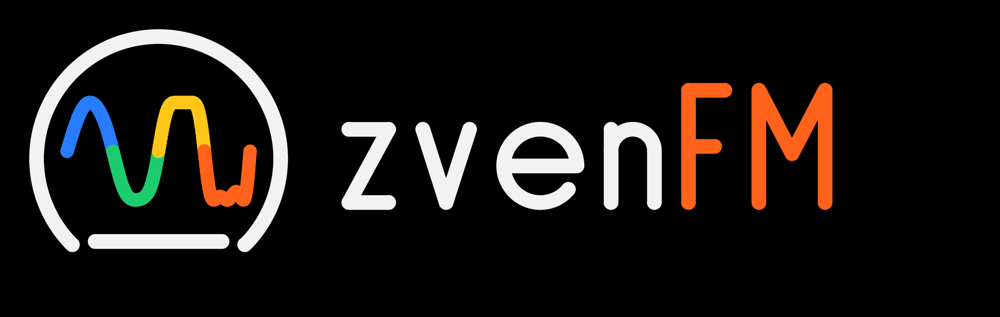
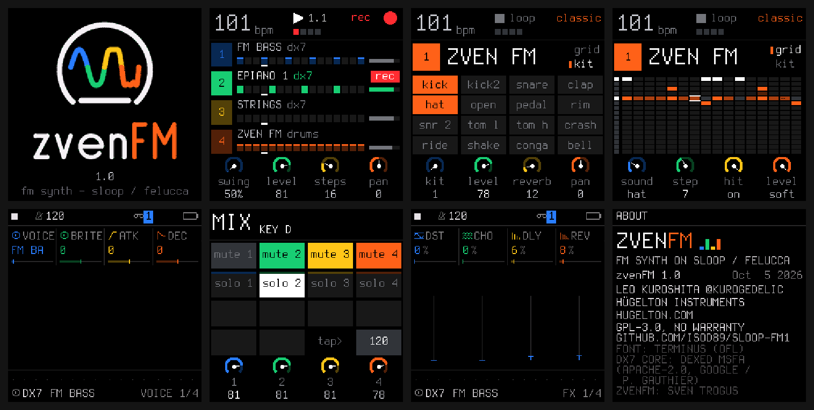

<b>A pure FM synth firmware for the M-VAVE FM-1.</b> 
Free and open source (GPL-3.0). Built on <a href="https://github.com/isod89/sloop-fm1">SLOOP</a>, which is based on <a href="https://github.com/hugelton/Felucca">Felucca</a>.

---

zvenFM turns the FM-1 into what it says on the box: an FM synthesizer. There is one engine, a six-operator DX7 voice (Dexed's msfa core, ported to integer C and checked bit-exact against Dexed). The drum track plays FM drums made with the same engine. SLOOP's live workflow stays as it is: tracks, layers, sequencer, song mode and effects. The sample engines, sample sets and the other eight engines are gone.

## Screens

Start-up, the tracks, the FM drum kit and its grid, the DX7 edit page, mix, FX sends, about. (Host renders of the firmware's own drawing code.)

## What it does

- **DX7 engine:** 6 operators, 32 algorithms, operator envelopes with rate and level scaling, pitch envelope, LFO with pitch and amp modulation, feedback. The same output as Dexed for the same patch.
- **17 factory voices** in the DX7 tradition (designed here, not copied): EPIANO 1 and 2, FM BASS, SLAP BASS, SUB BASS, BRASS, STRINGS, GLASS PAD, BELLS, MARIMBA, ORGAN, CLAV, PLUCK, FLUTE, SAW LEAD, KOTO and INIT VOICE.
- **Your own DX7 banks:** a standard 32-voice bulk dump (.syx, 4104 bytes) loads as U01–U32. The checksum is verified and every value is clamped to its range.
- **Macro knobs per voice:** BRITE (modulator levels), ATK, DEC and REL (the operator rates), FDBK.
- **Three synth parts plus a drum track**, sharing an 8-voice budget. Each part plays the whole keyboard (no split), and each track has its own pattern length.
- **FM drums:** 16 lanes on the white keys (kick, kick 2, snare, clap, closed / open / pedal hat, rim, tight snare, low / high tom, crash, ride, shaker, conga, cowbell). Five kits:
  - **ZVEN FM**, the factory kit
  - **TIGHT**, short and punchy
  - **BOOM**, long and deep
  - **METAL**, bright
  - **USER**, which plays the first 16 voices of your loaded .syx bank as the lanes
- **Drum details:** a pitch sweep on kicks and toms, a real multi-hit clap, and hat choke.
- **From SLOOP:** the layers (FX punch-in, edit, arp, steps, scale and chords, mix, song), free takes, swing, chorus / delay / reverb sends, DUST and DUCK, undo / redo, projects and user presets.

## Status

This is a work in progress. The host test suite passes (audio renders, voices, sequencer, UI, storage, update loader). It has not run on a device yet. Open items:

- **RAM:** the DX7 state adds about 18 KB, and `tools/build.py` checks the limit at link time. If it is too much, the user bank moves to flash.
- **CPU:** a real-chip measurement with all voices sounding is still missing.
- **Loading a .syx bank on the device:** the editor command and the flash slot are not done yet. The import code and its test are.
- **Web editor:** still SLOOP's; the sample pages need to come out.

## Building

See [BUILDING.md](BUILDING.md): the JieLi toolchain (`tools/get_toolchain.sh`) and three files of the AC79 SDK, then `./build.sh`. `tests/run_tests.sh` runs the host tests. To check the DX7 core against Dexed: `MSFA=<dexed>/Source/msfa sh tests/dx7ref/build.sh`.

Install the resulting `.fwsc` with `python tools/fm1_install.py build/<name>.fwsc`. Going back works with M-VAVE's own updater (M-UPGRADE) and the official firmware.

> Custom firmware is installed at your own risk. If an FM-1 no longer starts, recovery needs [FM-1-transporter](https://github.com/kurogedelic/FM-1-transporter).

## Credits

- **zvenFM:** Sven Trogus.
- **SLOOP** (isod89) and **Felucca** by Leo Kuroshita (@kurogedelic), Hügelton Instruments: the sequencer, UI, effects, storage, editor and installer.
- **DX7 core:** the msfa engine from Dexed (Apache-2.0; © 2012 Google, 2016–2025 Pascal Gauthier).
- **Font:** Terminus (SIL OFL 1.1).

## Licence

GPL-3.0-only (see [LICENSE](LICENSE) and [LICENSING.md](LICENSING.md)). No warranty. M-VAVE and FM-1 are trademarks of their owners; DX7 is a trademark of Yamaha. zvenFM is not affiliated with either. No Yamaha or M-VAVE voice data is included.
